# Build and Deploy an image classifier on IBM Cloud
## This hands-on lab builds a neural network to predict an input image as that of coffee, donut or a mug.

### 1. Search for Watson Studio service on IBM Cloud
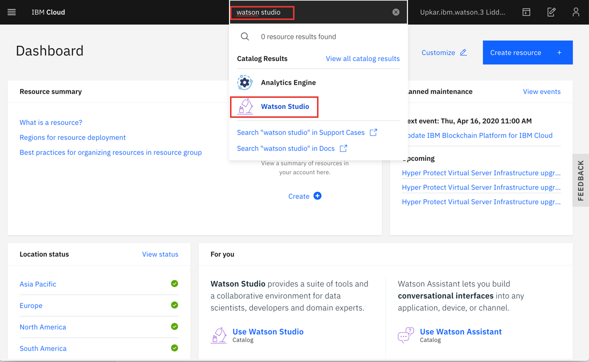

### 2. Create a Watson Studio instance
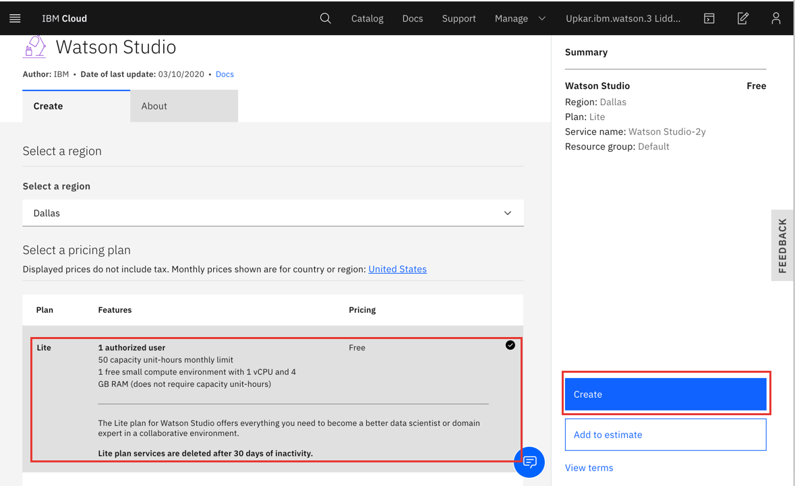

### 3. Click on `Getting Started` to launch Watson Studio
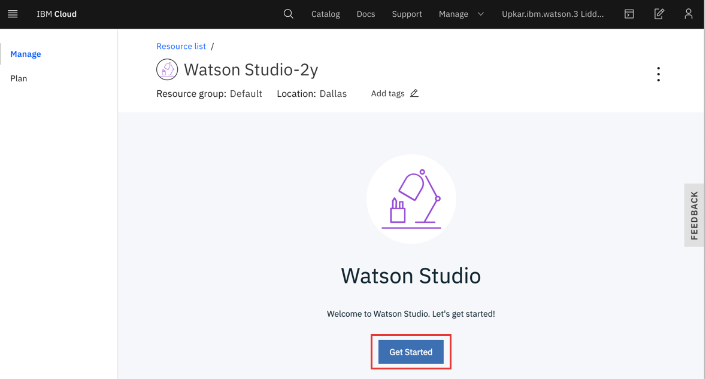

### 4. Start creating a `New Project` inside Watson Studio
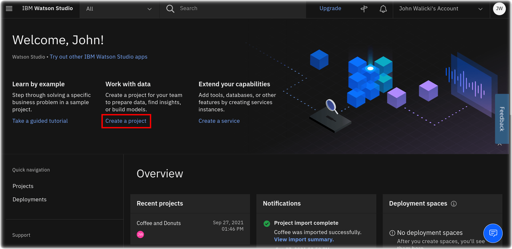

### 5. Create a project from a sample or file
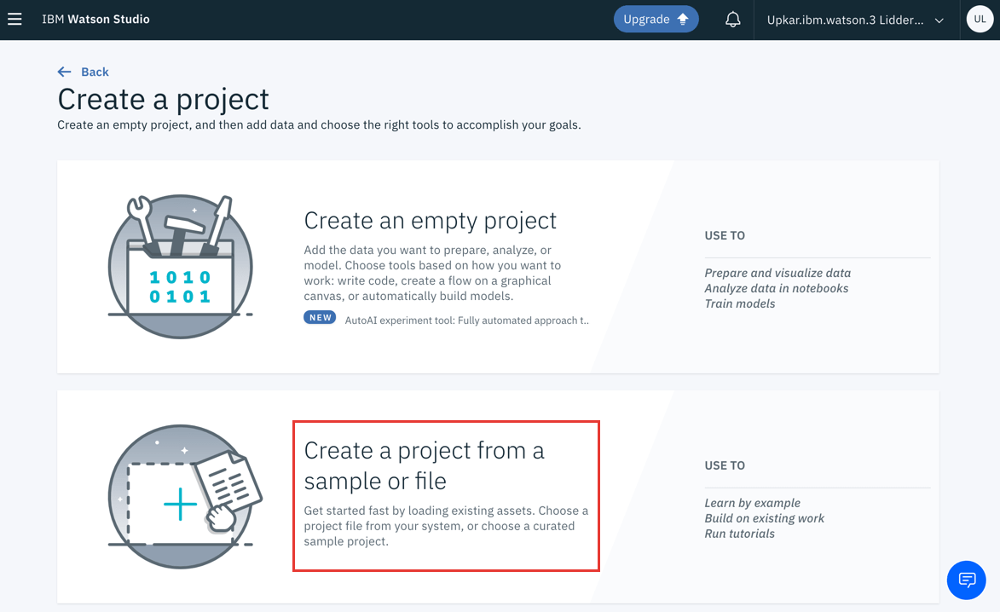

### 6. Create new storage service

### 7. You can leave the defaults and click on `Create`
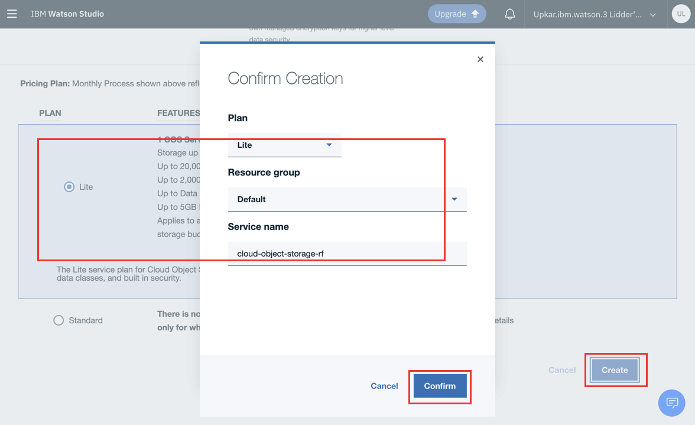

### 8. Upload the sample file to create the new project. You can find the sample zip file under [assets/coffee-donut.zip](assets/coffee-donut.zip).
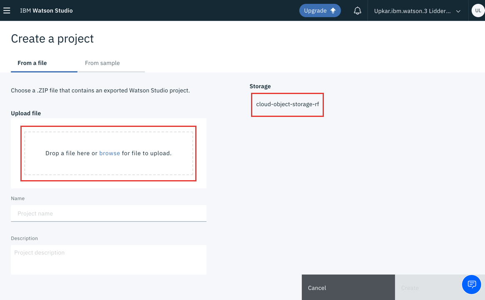

### 9. Finish uploading file and create new project
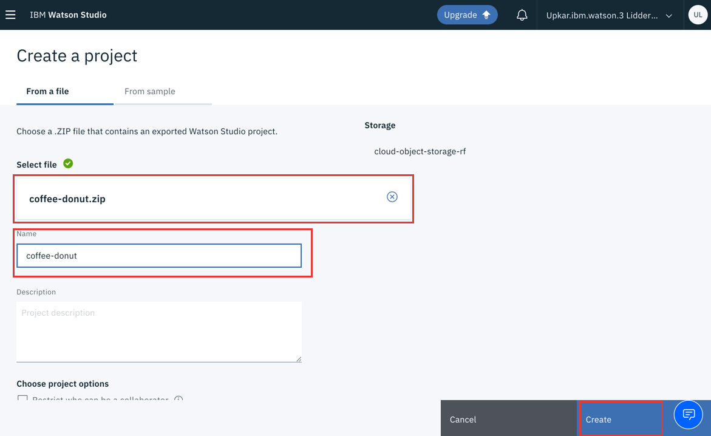

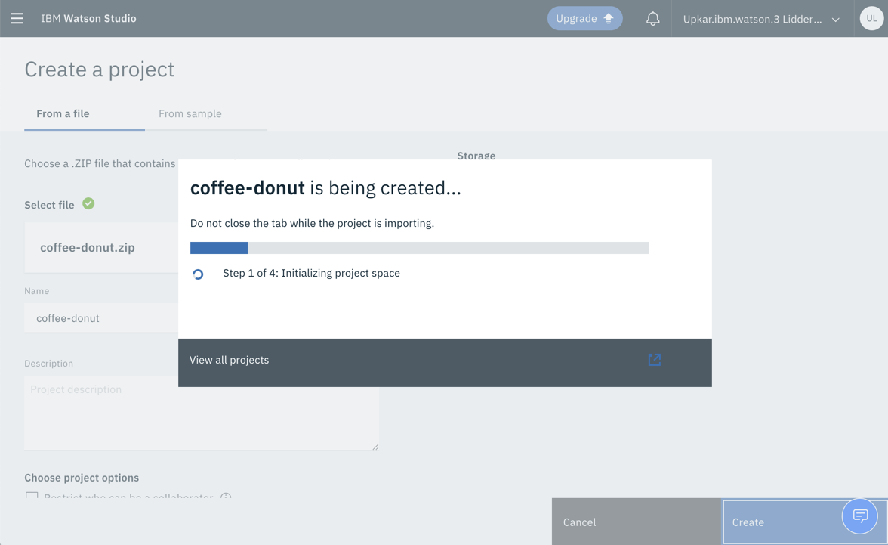

### 10. Once the project has finished, view project to see details
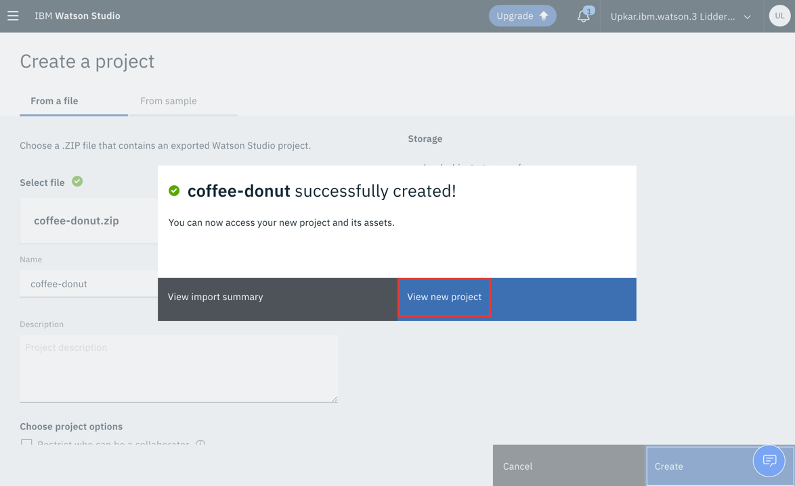

### 11. Open `Assets` section. This is where you will find the data and notebooks
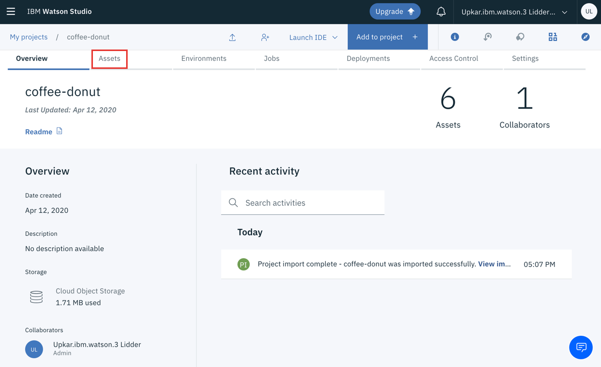

### 12. Scroll down to `Notebooks` and open the `Train a sample classifier` notebook
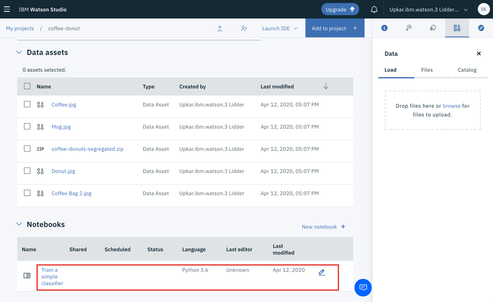

### 13. If your note is in read-only mode, use the pencil button to edit the notebook
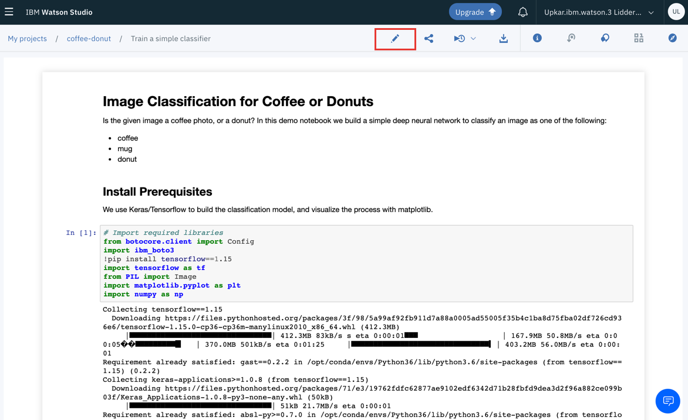

### 14. This will instantiate a new runtime for you to run the notebook
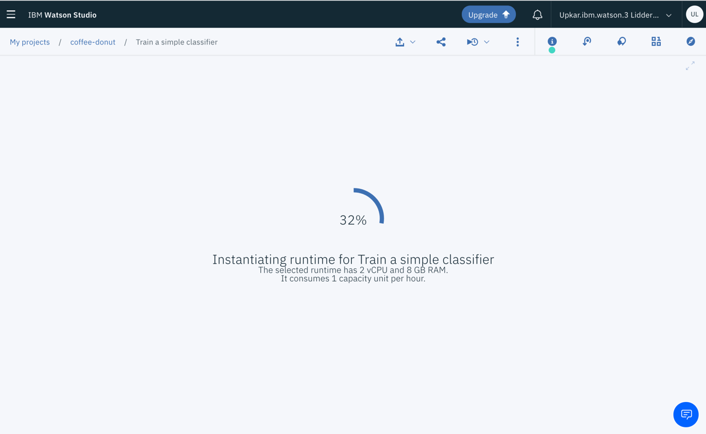

### 15. You can now run the cells to create the neural network!
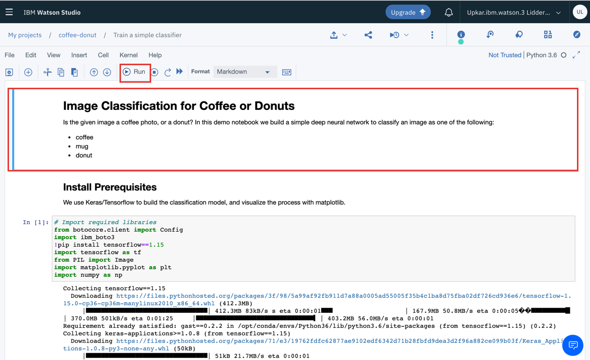

## Additional clarifications for the notebook

### 1. Adding credentials to the notebook
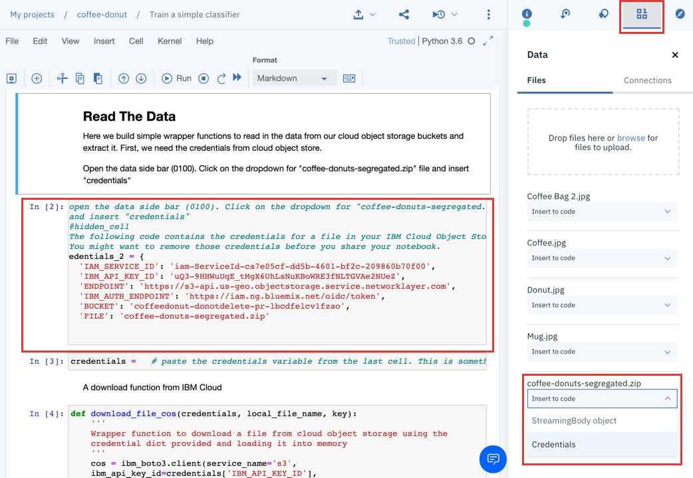

### 2. Using credentials in the notebook. Make sure you change the variable name to what was assigned in the last step when you added credentials to the notebook
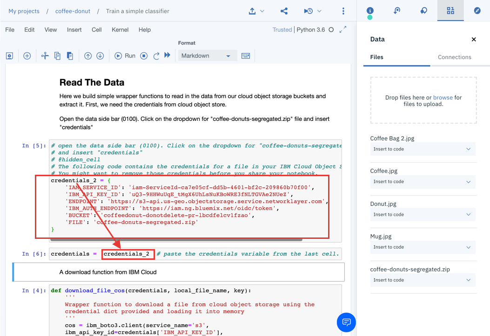