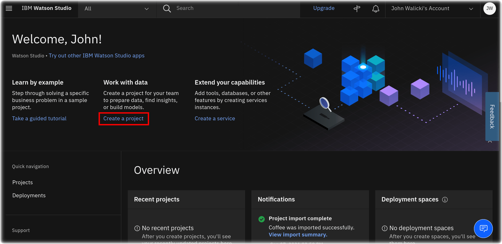

# Build and Deploy an image classifier on IBM Cloud
## This hands-on lab builds a neural network to predict an input image as that of coffee, donut or a mug.

The workshop provides you with all the data and assets you need to create the classifier on IBM Cloud. To get started, you can close this github repo or simply download the sample file under [assets/coffee-donut.zip](assets/coffee-donut.zip). You do not need to unzip the file, but simply upload it to Watson Studio as explained in the steps below. The zip file contains the following assets

```
assets
├── data_asset
│   ├── Coffee\ Bag\ 2.jpg
│   ├── Coffee.jpg
│   ├── Donut.jpg
│   ├── Mug.jpg
│   └── coffee-donuts-segregated.zip
└── notebook
    └── notebook:Train_a_simple_classifier_dam9_4_n1.ipynb
```
- data_asset/coffee-donuts-segregated.zip - this is your training data 
- data_asset/*.jpg - test images used to predict with the model
- Train_a_simple_classifier_dam9_4_n1.ipynb - this is the sample notebook that is used to train your image classifier.


## Prerequisites
1. This workshop assumes you have an IBM Cloud account. Please ask the workshop facilitator for the URL to sign up for IBM account. If you don't have a unique URL, you can [register here](https://ibm.biz/Bdq2TN) - https://ibm.biz/Bdq2TN. 

## Steps

### 1. Search for Watson Studio service on IBM Cloud in the Catalog or using the search bar as shown here


### 2. Create a Watson Studio instance


### 3. Click on `Getting Started` to launch Watson Studio


### 4. Start creating a `New Project` inside Watson Studio


### 5. Create a project from a sample or file


### 6. Create new storage service


### 7. You can leave the defaults and click on `Create`


### 8. Upload the sample file to create the new project. You can find the sample zip file under [assets/coffee-donut.zip](assets/coffee-donut.zip).


### 9. Finish uploading file and create new project


### 10. Once the project has finished, view project to see details


### 11. Open `Assets` section. This is where you will find the data and notebooks


### 12. Scroll down to `Notebooks` and open the `Train a sample classifier` notebook


### 13. If your note is in read-only mode, use the pencil button to edit the notebook


### 14. This will instantiate a new runtime for you to run the notebook


### 15. You can now run the cells to create the neural network!


## Additional clarifications for the notebook

### 1. Adding credentials to the notebook


### 2. Using credentials in the notebook. Make sure you change the variable name to what was assigned in the last step when you added credentials to the notebook
